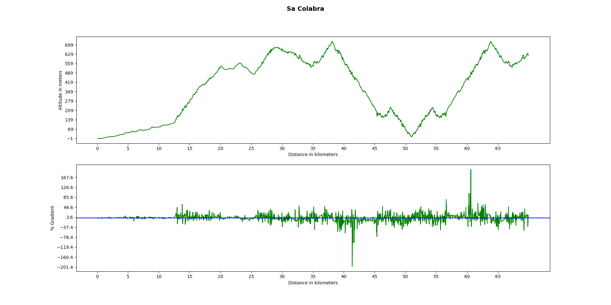

# Stopanalyser

stopanalyser is a tool to parse ride GPS data in gpx format, to report stops.
I wrote it to be able to better analyse my stopping behavior, on long rides.
The lat-long info in the output is useful to lookup the location, to better recollect details.
I use a Garmin Edge 500, and I convert the fit files to gpx, using gps-babel, with a command line like this:

````
gpsbabel -i garmin_fit -f input.fit -o gpx -F output.gpx

Usage:
-f: input file (GPX)
-g: granularity in minutes. eg: -g5 would only output recorded stops which are longer than 5 minutes.
-u: UTC offset. The timestamps are in UTC. If your timezone differs, simply provide the offset value.

ex:
pchengi@thebeast:~$ python stopanalyzer.py -f test.gpx -g 5 -u 2
(56.033813057, 12.616022487) 26.42 Apr 05 2017 17:39:33 0:1:58:12
(56.182073167, 13.029872334) 8.03 Apr 05 2017 19:39:58 0:3:58:37
(56.187120916, 13.057203625) 12.28 Apr 05 2017 19:54:05 0:4:12:44
(56.284144798, 13.338998264) 17.38 Apr 05 2017 21:39:14 0:5:57:53
(56.284268767, 13.338277924) 39.85 Apr 05 2017 21:56:57 0:6:15:36
(56.680912076, 13.863307682) 17.63 Apr 06 2017 01:56:07 0:10:14:46
(56.710076321, 13.858684978) 7.57 Apr 06 2017 02:26:55 0:10:45:34
(56.721048065, 13.871064211) 6.43 Apr 06 2017 02:49:50 0:11:8:29
(56.723954825, 13.866336147) 7.55 Apr 06 2017 03:09:54 0:11:28:33
(56.772399376, 13.900122677) 6.42 Apr 06 2017 03:40:29 0:11:59:8
Cumulative stoppage time in minutes: 208.88
````
# Elevprofiler

elevprofiler is a script that allows you to plot the elevation profile of a complete tcx track, or parts of it.

````
python3 elevprofiler.py -h
usage: elevprofiler.py [-h] [-f F] [-s S] [-e E] [-t T] [-m [M]] [-n [N]]
                       [-c [C] | -a [A]]

optional arguments:
  -h, --help  show this help message and exit
  -f F        input file
  -s S        starting point
  -e E        ending point
  -t T        title for graph
  -m [M]      specify values in miles instead of meters (output will still be
              in km)
  -n [N]      no graph display, just output elevation information and write
              output.pdf)
  -c [C]      not currently implemented
  -a [A]      additional filters

ex:
python3 elevprofiler.py -f Sacolabra.tcx -t 'Sa Colabra' -n
Total points: 2643
Total climb: 3681.00 m
Total descent: 3684 m
Total distance: 116209.41 m 
Net alt gain: 5.0

python3 elevprofiler.py -f Sacolabra.tcx -t 'Sa Colabra' -a -s 10000 -e 80000 -n
Total points: 2643
will eject 886 points
Total climb: 3209.00 m
Total descent: 2584 m
Total distance: 69842.41 m
Net alt gain: 625.0 
````

